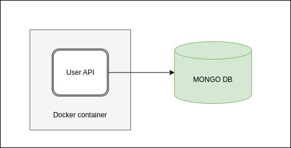

# users-api

User REST API to perform CRUD operations.

This api uses GO as programming language e Docker as container.

The database for this api is MongoDB.

All settings are done through Environment Variables.



## Requirements

>  [Go 1.18](https://go.dev/doc/install)   
>  [Docker](https://docs.docker.com/engine/install/)   
>  [Docker Composer](https://docs.docker.com/compose/install/)   
>  [Swag](https://github.com/swaggo/swag/cmd/swag)

<br/>

## Configurations
<br/>

Environment variables :

Variable          | Description                          | Default Value |
------------------|--------------------------------------|---------------|
PORT              |  Server port                         |   3000        |
MONGODB_URI       |  Mongo DB Uri connection             |               |
MONGODB_DATABASE  |  Mongo database name                 |               |
RATE_LIMIT        |  Rate limit value                    |   1           |  
RATE_LIMIT_TOKENS |  Rate limit tokens value             |   5           |  
API_USER          |  Api Basic auth user                 |   apiuser     | 
API_PASS          |  Api Basic auth password             |   apipass     | 


## Generate API swagger documentation
<br/>

This API Documentation is generate using swagger.

Execute the command below :
```
$ make swag
```

<br/>

## Running API Local
<br/>

Run api envorinment locally with docker-compose

Execute the command below :

```
$ make envup
```

## Finishing API Local
<br/>


Finish api envorinment locally with docker-compose

Execute the command below :

```
$ make envdown
```

## API Documentation URL
<br/>

Access the URL below :

[http://localhost:3000/doc/index.html](http://localhost:3000/doc/index.html)


## Running Tests
<br/>

Execute the command below :

```
$ make test
```

## Technical Debts
<br/>

- Implement logs structure
- Improve API Auth
- Configure CORS to api
- Implement Code Coverage

